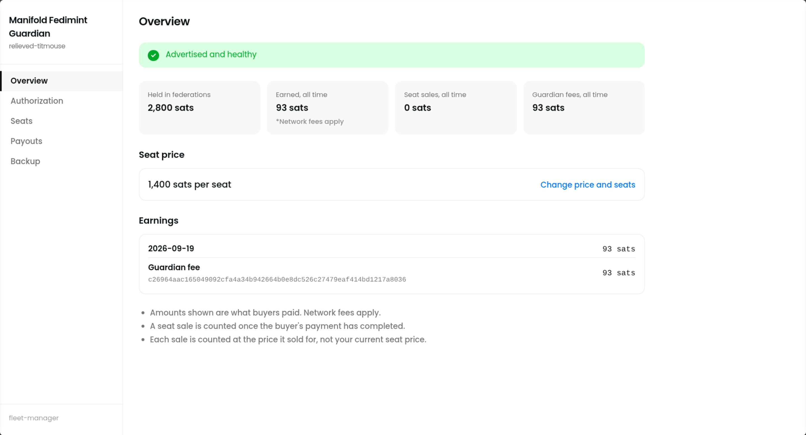
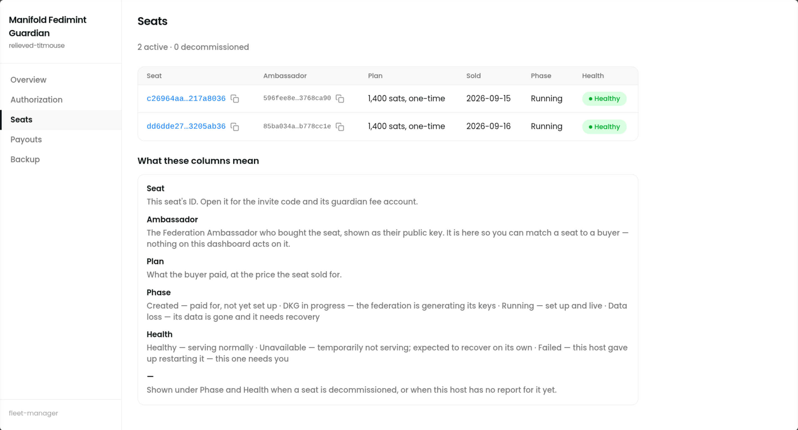
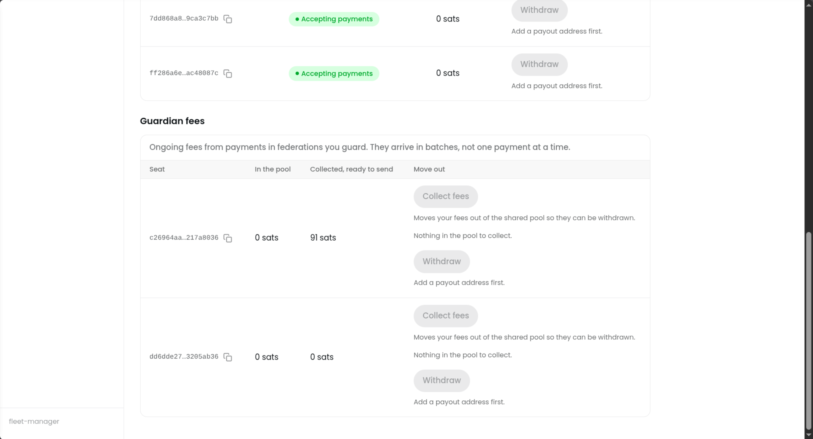

# Add Manifold Fedimint Guardian

[Submitted PR #6110](https://github.com/getumbrel/umbrel-apps/pull/6110) · [Package changes](https://github.com/fedibtc/umbrel-apps/compare/master...add-manifold-fedimint-guardian) · [App files](../manifold-fedimint-guardian/)

## Type

New app

## App

- App ID: `manifold-fedimint-guardian`
- Upstream project: https://github.com/fedibtc/manifold
- Version: `0d31e0b7`
- Image: `ghcr.io/fedibtc/manifold-fman:0d31e0b738ed91b628194458a99c306356e60327@sha256:415dc8fd17df110ad5c30eb2116dd7fbefbbb2c8f1736cea1773449bc9c843d7`

## Summary

Operate guardian seats for multiple Fedimint federations and earn fees from a single node.

## Verification

- Umbrel 1.7.3 / amd64: fresh install, browser setup, password login, restart
  and same-image package update passed. Identity and settings were preserved.
- Unauthenticated admin requests were rejected, including from another container.
- Official lint and image checks: 0 errors; UDP-range warning checked manually.
  Public images verified for amd64 and arm64; no arm64 runtime test performed.

Testing used a disposable identity and an untrusted test credential, with seat
offers disabled. No production guardian seats were created. Telemetry
registration logged a warning with that test credential.

## Reviewer testing

To complete setup and inspect the dashboard, authorize your own test instance:

1. In [PeerBadge](https://app.peerbadge.org), use **Sign a PeerBadge** and **Get a PeerBadge** to issue
   yourself a badge. Use two browser profiles or devices for the signer and
   holder, and follow the QR exchange between them.
2. In the holder's **Settings**, tap the **Build** label at the bottom seven
   times, then enable **Skip authorization cooldown**.
3. Open the badge under **My badges**, choose **Authorize application**, and
   scan or paste the authorization request from the guardian setup screen.
   Back in the guardian, select **Check now** and finish setup. Leave the seat
   price blank for dashboard testing.

A self-issued badge enables this dashboard test but does not make the instance
eligible for production selection.

Actual federation formation participation requires a number of guardian software
instances to be live and advertised, and a compatible client choosing from among
them to make a federation. The [Guardian guide](https://manifold.fedi.xyz/guardian-guide)
describes this flow and includes a full video walkthrough.

## Notes

Requires Bitcoin Node on mainnet and guardian authorization to offer seats.
The dashboard uses the app password shown by Umbrel. Umbrel login stays enabled.
Only guardian UDP ports are published. Backups exclude telemetry journals.

The manifest leaves `gallery: []` for Umbrel's final artwork.

Prepared with AI assistance by Codex (GPT-6), agent `/root`.
